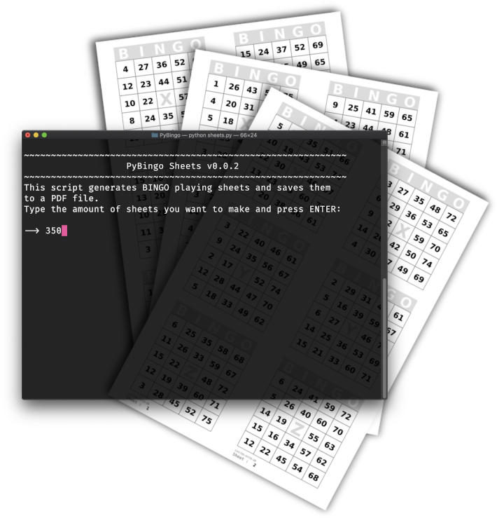
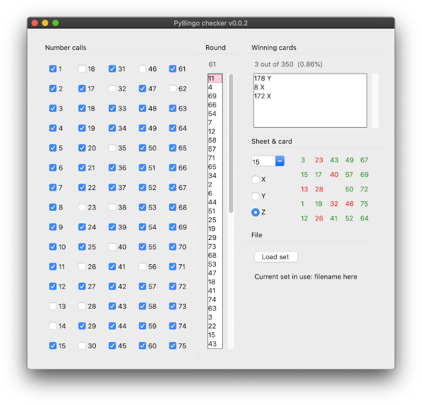

# PyBingo
> Python script to generate BINGO sheets (75 balls, 3on Vertical).

PyBingo's ``sheets.py`` script generates new BINGO sheets and saves them to a
PDF file. The sheet design should be reasonably printer friendly and the
generated PDF file sizes are are relatively small.

PyBingo also contains a script to check for "full card BINGO" when playing
with the generated PyBingo sheet-sets.



## Installation

**macOS & Linux:**
Just save the *PyBingo* folder to a location of your choosing.

**Windows:**
These scripts haven't been tested on Windows, but should work (?) the same as
with Mac & Linux systems.

## Requirements

* [Python 3.x](https://www.python.org "Python's homepage")
* [matplotlib](https://matplotlib.org "Matplotlib's homepage")

To check which version of Python3 you have (if any), open a terminal and type:

```
python3 -V
```

Assuming a Python 3.x is already present on the system, likely *pip* will be as
well. By Using pip it is easy to install matplotlib and its dependencies
automatically. Open a terminal and type:

```
pip3 install matplotlib
```

*(PyBingo was developed using Python 3.7.5 & matplotlib 3.1.1 on macOS
Catalina.)*

## Usage

### Sheet generator

Open a terminal and *cd* to the *PyBingo* directory, then execute the
``sheets.py`` file with Python:

```
python3 sheets.py
```

When the script asks for the amount of sheets, type your desired amount and
press ENTER, then the script starts generating the sheets. During this process
it will give feedback on the progress.
*(Depending on your hardware & the amount of sheets, it may take some time.)*

When the script is done it will open the ``BINGO_sheets`` folder where it has
saved the PDF file with an unique ID sheet-set name. Now you can open this
file with a PDF viewer and send it to a printer!

### BINGO checker



Open a terminal and *cd* to the *PyBingo* directory, then execute the
``checker.py`` file with Python:

```
python3 checker.py
```

Select the corresponding CSV file which was also saved in the ``BINGO_sheets``
folder. Now just click the checkboxes of the numbers which are being called.
*(Loading another CSV set-file while the script is already running doesn't
work yet, you need to quit and restart the script in order to do so. WIP.)*

## Release History

* 0.0.2
    * Work in progress.

## Meta

tumtidum

Distributed under the GNU GPLv3 license. See ``LICENSE`` for more information.

[https://tumtidum.github.io/PyBingo](https://tumtidum.github.io/PyBingo)

[https://github.com/tumtidum](https://github.com/tumtidum)
